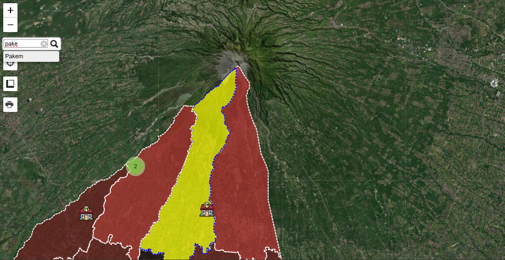
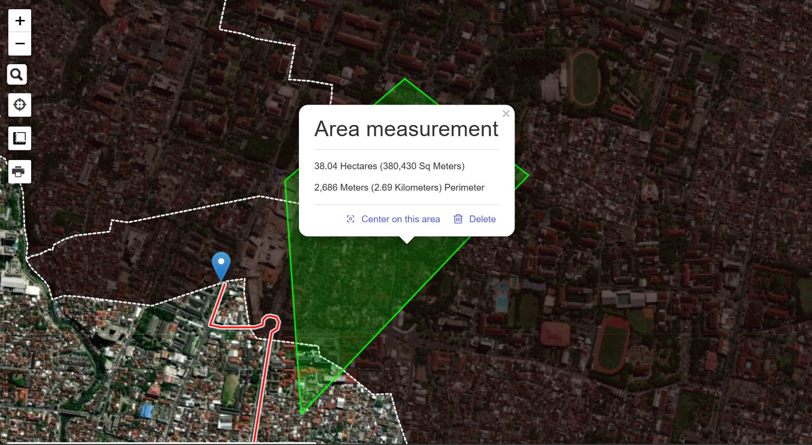
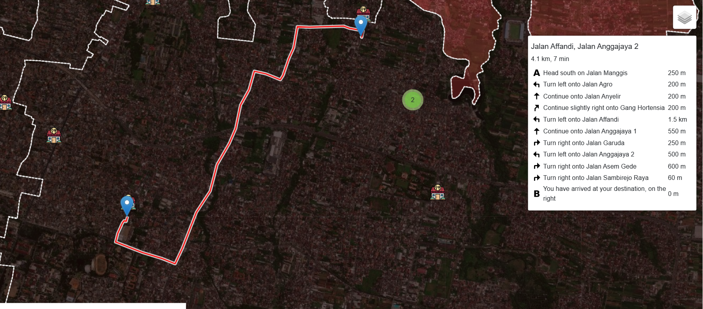
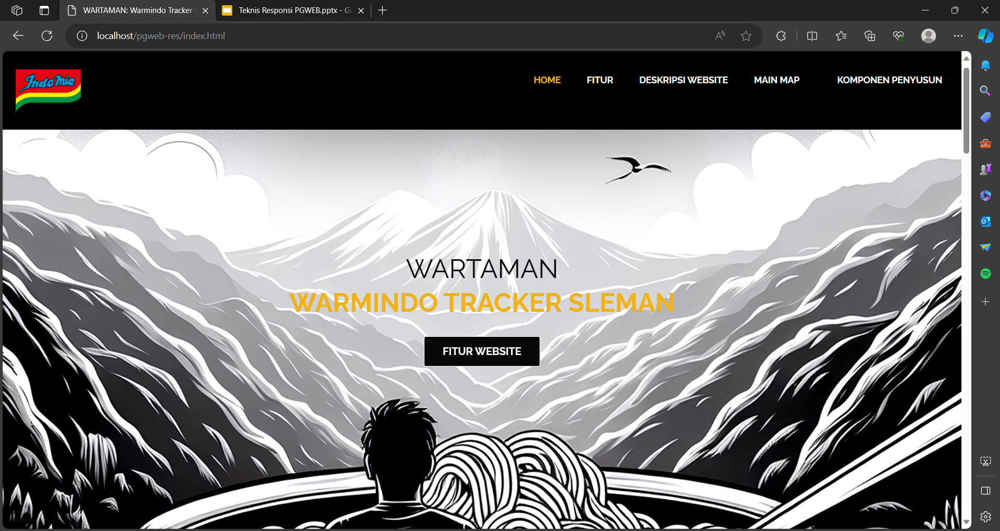

# pgweb-resp
Perencanaan produk web GIS dan GIT
___
***Test***
>User identity

Nama: Dhimar Fadhilansyah Darojat

NIM: 22/493570/SV/20710

Kelas: PGPB-A

>Nama produk 
WARTAMAN: WARMINDO TRACKER SLEMAN

>Deskripsi produk
WEB GIS yang dibuat dalam proyek kali ini menampilkan tema persebaran warmindo (warung makan indomie) yang terdapat pada Kabupaten Sleman, disertai dengan beberapa fitur dari WEB GIS seperti routing, measurement tool, geolocation, dan lain sebagainya.

>Komponen pembangun produk
Leaflet.JS, Bootstrap, HTML, CSS

>Sumber data
Data pribadi

>Tangkapan layar komponen penting produk

